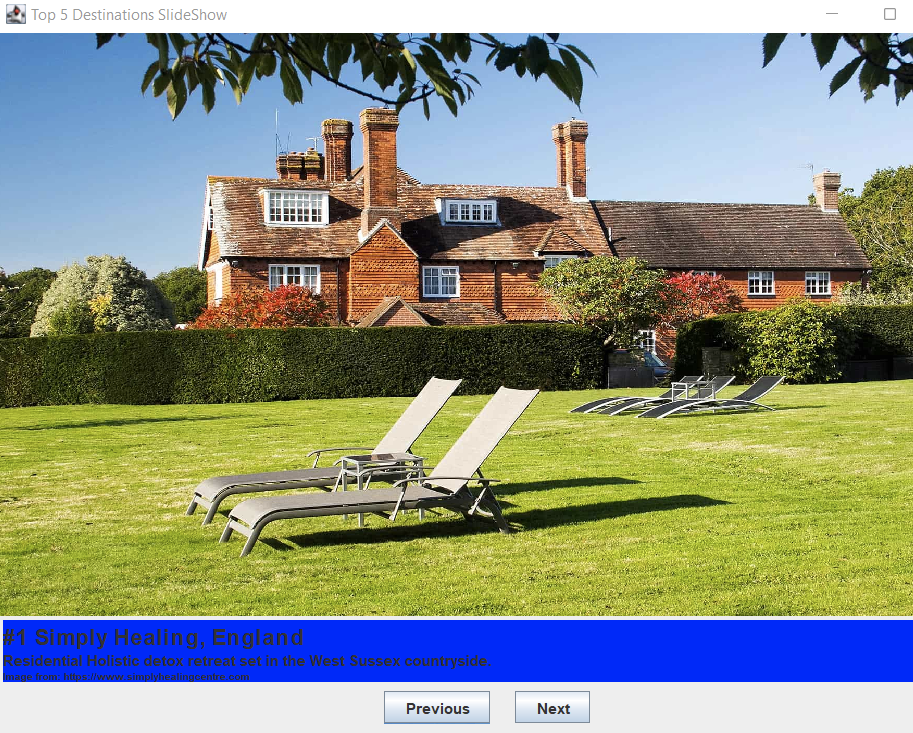
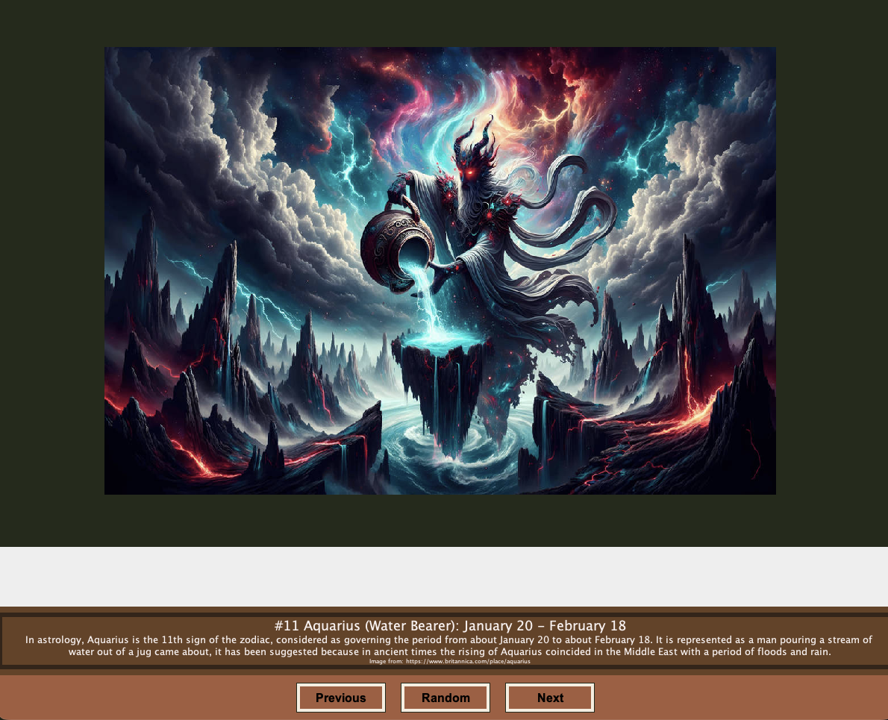

# <pre align="center"> Enhancement Two: Algorithms and Data Structures </pre>

## <pre align = "center"> Zodiac Java Slideshow </pre>

<code> System files located in the Zodiac folder </code>

For Enhancement Two: Algorithms and Data Structures, I chose to enhance an artifact from my previous CS 320: Software Development Lifecycle course—a Java slideshow project featuring various zodiac signs with next and previous buttons. I selected this project because it demonstrates my ability to work on a range of projects and programming languages, particularly highlighting my object-oriented programming skills.

This project is an excellent example for showcasing algorithms and data structures, as it inherently involves multiple elements of programming logic and algorithmic design. Specifically, I implemented logic to add each slide and its text, enabling smooth navigation between slides. When enhancing this project, I had to recreate the source code from scratch since the original was lost, relying only on remnants from earlier class projects. This process allowed me to apply new techniques I've learned since then, such as using string concatenation for better content organization and applying the DRY (Don’t Repeat Yourself) principle. Instead of repeating conditional statements for each destination, I created a single text variable that adapts based on the chosen option within the condition.

I also added further enhancements, including a random button featured in my initial plans. Although I encountered challenges in displaying the button and text boxes correctly within the Java application—which I'm still working to resolve—the random button itself works by utilizing Java's random library to generate a number from 1 to 12. This number determines how many times a for loop calls the goNext function to iterate through the slides. Additionally, I used the Color module to adjust background, button, and text colors, moving away from the original bright green and blue theme to more natural tones that are still being refined ahead of final release.

Going through the expected course outcomes, I was able to meet two of them specifically with this artifact which include:

<code> Course Outcome 2: Design, develop, and deliver professional-quality oral, written, and visual communications that are coherent, technically sound, and appropriately adapted to specific audiences and contexts</code>

<code> Course Outcome 3: Design and evaluate computing solutions that solve a given problem using algorithmic principles and computer science practices and standards appropriate to its solution, while managing the trade-offs involved in design choices </code>

The Zodiac slideshow demoonstrates a professionaly designed and developed solution with visual appeals that meet today's industry of slideshows. The information contained in the code of this project as well with Java is heavily commented that allows for any user today to easily understand what each section of the Java file continas and how it corresponds to the working application. By employing object-oriented programming techniques, I was able to ensure that ech interface element was implemented as a distinct class which makes modification and future updates easier to manage. I also included a random button that was utilized to moderinze the application which also included updating methods and functions to assist with any resizing issues as the application is capable of running on multiple resolutions. 

## <pre align="center"> Future Updates </pre>

The applicaiton itself serves its purpose of educating the user about the twelve zodiac signs as well as some basic information about them. If this applicaiton were to be useful today, it would have to either contain information that users have never seen before or transformed and utilized as an application within a website for instance. I believe that I will take the first route and cnotinue to expand on my object-oriented programming skills and see what else I can do to make this more appealing such as adding a connection to a database that has additional information about eash zodiac sign.

## <pre align="center"> Original Slideshow - Destination Trips </pre>

## <pre align="center"> Updated Zodiac Slideshow </pre>

