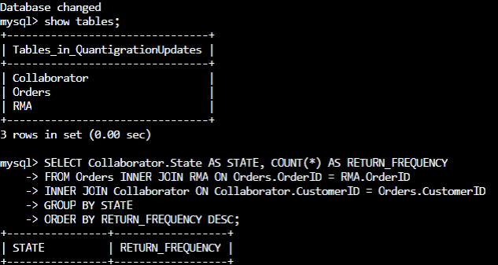
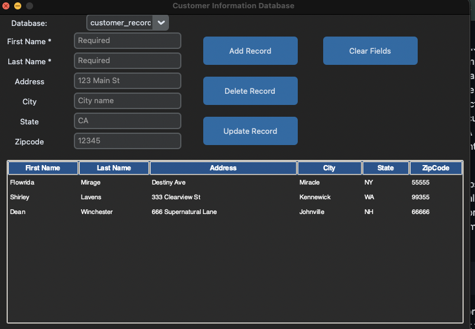

# <pre align="center"> Enhancement Three: Databases </pre>

## <pre align="center"> Customer Records Database </pre>

<code> System files located in this directory </code>

For Enhancement Three: Databases, I’ve chosen to update was to enhance a MySQL database that I had originally created from DAD-220. The original project was one that created an address book built with a simple database that had options for the user to add, update or delete records from the database. The entire project was built using SQL and so to utilize it you would need to do so in a command line interface. To enhance this project, I decided to add a user interface utilizing Python and SQLite.

The project itself was to enhance this database system by using Python and SQLite to create an interface and GUI that connects to the database files to update and utilize. I have personally never done this type of project before so performing enhancements of an entire Python built user interface was one that I felt met a lot of criteria for this capstone. Most of the enhancements were done by utilizing the “tkinter” module which allowed for the creation of the basic GUI and then utilization of customtkinter to create a dark user theme that seems to be popular amongst customers with today’s applications.

Going through the expected course outcomes, I was able to meet two of them specifically with this artifact which include: 

<code> Course Outcome 1: Employ strategies for building collaborative environments that enable diverse audiences to support organizational decision making in the field of computer science </code>

<code> Course Outcome 5: Develop a security mindset that anticipates adversarial exploits in software architecture and designs to expose potential vulnerabilities, mitigate design flaws, and ensure privacy and enhanced security of data and resources </code>

The updated application that now runs as a Python script from within these files as "main.py" meets these outcomes by first developing a front-end database with Python and SQLite which fosters collaboration by allowing users, including those without programming expertise, to easily input data and contribute to a more inclusive and efficient working environment by being able to easily update records and providing ease of use. Given the data-centric nature of this project, robust security protocols were implemented by having the database reside locally rather than online, files utilizing encoding to prevent unauthorized access, all inputs are now processed as a string and incorporated into a database upon activation via a designated button, various SQL injection methods including attempts such as 105: Drop Table addresses were systematically tested. Overall, there were no SQL Injection attempts that were successful which indicates that the program meets security requirements.

## <pre align="center"> Future Updates to this artifact </pre>

The updated Customer Records Database application with a completely new GUI does provide for users without any scripting knowledge to be able to easily utilize this tool. It can be incorporated into a business that would need to store any sort of information so I believe I would try to continue to update it to help streamline this process. Perhaps adding additional security precautions to re-ensure potential clients that their information is safe and secured.

## <pre align="center"> Original Project </pre>

## <pre align="center"> Updated Project - Customer Records Database </pre>

