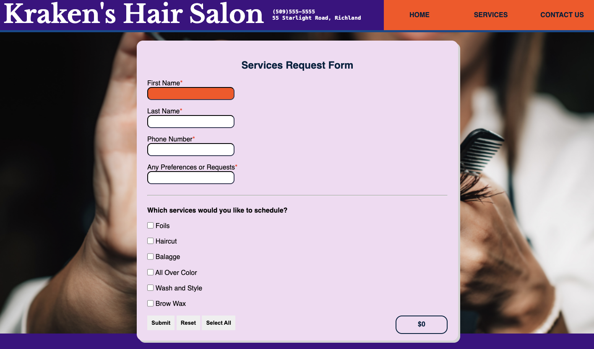
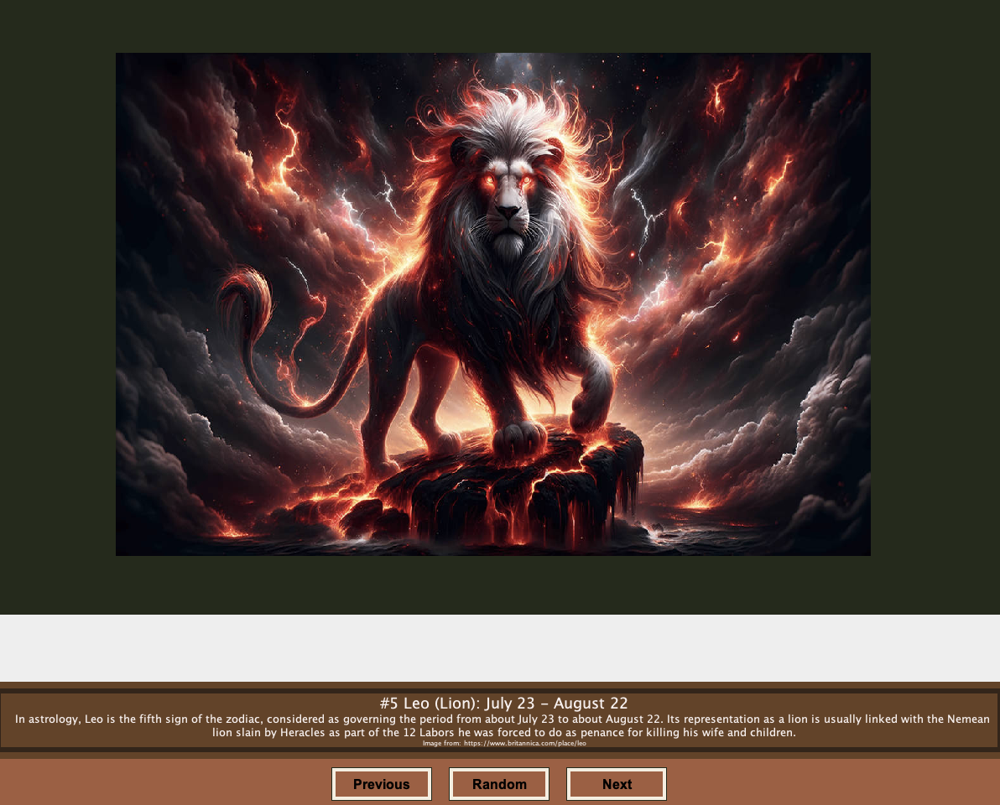
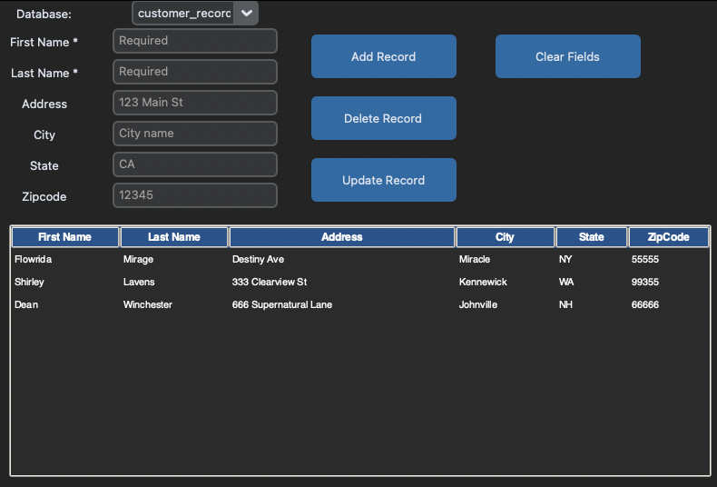

  

#  
 Computer Science Capstone 

## 
 CS-499 | SNHU 

 

## Final Computer Science Capstone Project

Welcome to my final computer science capstone project. The following pages include the three artifacts that I have chosen to properly update and design to meet specific course outcomes in order to complete this project successfully. This page begins with a code review of the three artifacts that I have chosen with planned modifications that will be performed to meet the course outcomes. A brief overview of the projects selected with links to each project's readme and associated files. The last section is a professional self-assessment that reflects on my time here at SNHU and how I will apply these skills to my professional career as I move forward with this degree.  

### Code Review

Code review is a systematic process where developers check each other’s code for errors, quality, and project standards before merging. It catches bugs, encourages collaboration, and ensures best practices, focusing on functionality, design, security, and coding style to make software reliable and maintainable.

<code> You can watch the code review <a href=""> HERE </a>.</code>

  

### Project 1: Software Engineering and Design

The first artifact of this portfolio is a Hair Salon website where customers can fill out a form with their chosen services and see what their total cost will be for their appointment. The entire website is built from backend to frontend by me and is a great example of my full stack capabilities.

  

<code> You can see the full report and code for this project <a href="https://github.com/MexiOtter84/troy_ayon.github.io/tree/master"> HERE </a>. </code>

 

### Project 2: Algorithms and Data Structures

The second artifact chosen for this portfolio is a slide show that contains information about all twelve zodiac signs which was written in Java. This artifact displays my knowledge of Object Oriented Programming along with the implementation of design aspects.

  

<code> You can see the full report and code for this project <a href="https://github.com/MexiOtter84/troy_ayon.github.io/tree/main/Artifact%202"> HERE </a>. </code>

 

### Project 3: Databases

The third artifact selected for this portfolio is a database project featuring a Python TKinter graphical user interface, which utilizes SQLite for database communication. This artifact demonstrates my proficiency in data collection and interpretation.

  

<code> You can see the full report and code for this project <a href="https://github.com/MexiOtter84/troy_ayon.github.io/tree/Artifact-3/Artifact%203/CustomerRecords"> HERE </a>. </code>

 
 

## Professional Self-Assessment

As I approach the completion of my studies in the Computer Science program at Southern New Hampshire University (SNHU), I find it valuable to reflect on my academic journey and evaluate how my experiences have prepared me to continue my career as a software developer. 

The curriculum at SNHU offered a comprehensive foundation in computer science principles, programming languages, and software engineering methodologies. Throughout the program, I gained proficiency in languages such as Python, Java, and C++, which are essential tools in the software development industry. Courses in algorithms, data structures, and database management systems challenged me to think critically and solve complex problems efficiently. Collaborative projects and hands-on assignments allowed me to apply theoretical concepts to real-world scenarios. Participating in team-based software development projects improved my communication skills and taught me the value of effective collaboration, version control, and agile practices. These experiences mirror the dynamics of professional development environments and have equipped me with the technical and interpersonal skills necessary for success.

My primary career goal is to advance as a software developer, building innovative solutions and contributing to impactful projects. The coursework and extracurricular opportunities at SNHU have directly supported this ambition. By working on this capstone project and internships, I have had the chance to design, develop, and deploy software applications, which closely aligns with the responsibilities I aim to take on as I move forward in my career. Additionally, SNHU emphasized the importance of lifelong learning and adaptability in technology. I have developed a growth mindset, staying current with emerging technologies and best practices. This attitude is crucial in a field where rapid change is the norm, and it will continue to guide my professional development as I pursue new challenges and opportunities.

The following are the five course outcome objectives that we had to meet to complete this final capstone successfully. For each one below, I have listed the outcome that we had to meet as well as how I met them with the given artifacts that I had updated from previous courses. Project one was originally created in CS-200 utilizing Python to build a calculator, but I was able to take that application and utilize what I have learned in CS-465 to create a website from a full stack perspective. Project two was originally taken from CS-320 which was built in Java which was originally a vacation slide show. I took the information from that slide show and updated it to contain all twelve zodiac signs and included information about them which showcases my knowledge with Object-Oriented-Programming. The final artifact that I chose came from CS-260 which was a database created in Python that acted as a program ran in terminal to add items to the database. I was able to utilize my knowledge with Python, SQLite and utilized the TKinter module which allowed for the creation of a basic GUI that allows users to access the database from a simple application as opposed to attempting to utilize it in terminal.

<code> Course Outcome 1: </code> I Employed strategies for building collaborative environments that enable diverse audiences to support organizational decision-making in the field of computer science by completing the code review before beginning my enhancements. Code review plays a critical role in the successful delivery of software projects by enabling developers to identify areas for improvement through comprehensive analysis. This process supports effective organizational decision-making. A similar benefit can be observed in Project 3: Databases, which involved developing a front-end database with Python and SQLite. This project fosters collaboration by allowing users—including those without programming expertise—to easily input data, contributing to a more inclusive and efficient working environment.

<code> Course Outcome 2: </code> I Designed, Developed, and Delivered professional-quality oral, written, and visual communications that are coherent, technically sound, and appropriately adapted to specific audiences and contexts by completing Project 1: Software Engineering and Design. This project is grounded in a professionally developed front-end design, tailored specifically for business use. Both the visual elements and written content adhere to high standards of professionalism, resulting in a cohesive and technically robust website. Additionally, the backend infrastructure complements the front-end seamlessly, reflecting my comprehensive expertise in full stack development.

<code> Course Outcome 3: </code>  I Designed and Evaluated computing solutions that solve a given problem using algorithmic principles and computer science practices and standards appropriate to its solution while managing the trade-offs involved in design choices by completing Project 2: Algorithms and Data Structures. For this project, I enhanced a Java Slideshow by improving both its design and functionality. Employing Object-Oriented Programming techniques, each interface element, such as buttons, was implemented as a distinct class. Several improvements were made to the user interface and button functionalities, including the introduction of a random button that presents users with information about a random zodiac sign. This feature provides greater flexibility, allowing users to navigate without relying solely on sequential next and previous buttons. Furthermore, I upgraded the application's visual design and carefully considered the trade-offs associated with various design choices. To modernize the project, I incorporated a cohesive color scheme and imported new modules for expanded functionality. Design issues, such as buttons being partially cut off on certain screen sizes, were resolved through the implementation of updated methods and functions.

<code> Course Outcome 4: </code> I Demonstrated an ability to use well-founded and innovative techniques, skills, and tools in computing practices to implement computer solutions that deliver value and accomplish industry-specific goals by completing Project 1: Software Engineering and Design. For this project, I designed and improved a Hair Salon Website that lets potential customers select services and see their total instantly. Achieving this required developing both the backend and frontend—demonstrating full-stack skills and working with HTML, CSS, and JavaScript. I implemented modern features like a responsive layout and an interactive form. The web form detects when users leave fields such as first name, last name, or phone number empty, highlighting those fields in red. This project also achieves industry-specific objectives by providing a web form where clients can easily choose their preferred services.

<code> Course Outcome 5: </code>  I Developed a security mindset that anticipates adversarial exploits in software architecture and designs to expose potential vulnerabilities, mitigate design flaws, and ensure privacy and enhanced security of data and resources by completing Project 3: Databases. Given the data-centric nature of this project, robust security protocols were implemented. The database resides locally rather than online, with the files utilizing basic encoding to prevent unauthorized access. All input is processed as a string and incorporated into the database upon activation via a designated button. Various SQL Injection methods, including attempts such as 105; DROP TABLE addresses, were systematically tested. No SQL Injection attempts were successful, indicating that the program meets security requirements.

